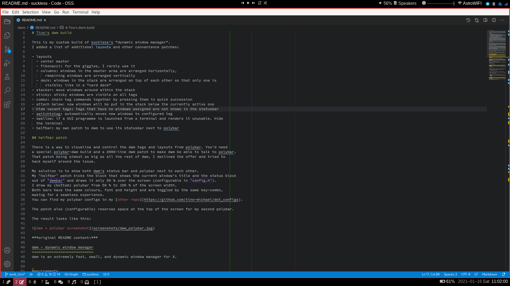

# Tino's dwm build

This is my custom build of suckless's "dynamic window manager".
I added a list of additional layouts and other convenience patches:

- layouts
  - center master
  - fibonacci: for the giggles, I rarely use it
  - columns: windows in the master area are arranged horizontally,
      remaining windows are arranged vertically
  - deck: windows in the stack are arranged on top of each other so that only one is
      visible; like in a "card deck"
  - bottomstack: master area on top, stack windows below either horizontally (standard) 
      or vertically as well (shift-modified)
- stacker: move windows around within the stack
- sticky: sticky windows are visible on all tags
- combo: chain tag commands together by pressing them in quick succession
- attach below: now windows will be put in the stack below the currently active one
- hide vacant tags: tags that have no windows assigned are not shown in the statusbar
- switchtotag: automatically moves new windows to configured tag
- swallow: if a GUI programme is launched from a terminal and renders it unusable, hide
  the terminal
- halfbar: my own patch to dwm to use its statusbar next to polybar
- xresources: loads colours (and other settings) from Xresources

## halfbar patch

There is a way to visualise and control the dwm tags and layouts from polybar. You'd need
a special polybar-dwm build and a 2000-line dwm patch to make dwm be able to talk to polybar.
That patch being almost as big as all the rest of dwm, I declined the offer and tried to
hack myself around the issue.

My solution is to show both dwm's status bar and polybar next to each other.
My `halfbar` patch kicks the block that shows the current window's title and the status block
out of `dwmbar` and draws it only 50 % over the screen (configurable in `config.h`).
I draw my (bottom) polybar from 50 % to 100 % of the screen width.
Both bars have the same colours, font and height and are toggled by the same key-combo,
making for a seamless experience.
You can find my polybar configs in my [other repo](https://github.com/tino-michael/dot_configs).

The patch also (configurable) reserves space at the top of the screen for my second polybar.

The result looks like this:

***original README content:***

dwm - dynamic window manager
============================
dwm is an extremely fast, small, and dynamic window manager for X.

Requirements
------------
In order to build dwm you need the Xlib header files.

Installation
------------
Edit config.mk to match your local setup (dwm is installed into
the /usr/local namespace by default).

Afterwards enter the following command to build and install dwm (if
necessary as root):

    make clean install

Running dwm
-----------
Add the following line to your .xinitrc to start dwm using startx:

    exec dwm

In order to connect dwm to a specific display, make sure that
the DISPLAY environment variable is set correctly, e.g.:

    DISPLAY=foo.bar:1 exec dwm

(This will start dwm on display :1 of the host foo.bar.)

In order to display status info in the bar, you can do something
like this in your .xinitrc:

    while xsetroot -name "`date` `uptime | sed 's/.*,//'`"
    do
    	sleep 1
    done &
    exec dwm

Configuration
-------------
The configuration of dwm is done by creating a custom config.h
and (re)compiling the source code.
